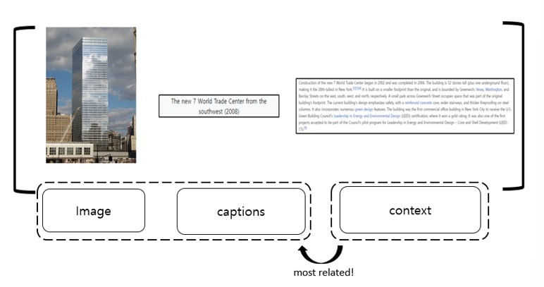

# Multi Modal Dataset based on Wikipedia English Articles 
We constructed a multimodal dataset using Wikipedia Enlglish articles. This dataset is composed of 3 types, **[An Image / A Caption of an image / A most related context]**. The number of pairs are **about 85,000 multimodal pairs** from English articles. There are multiple images and captions within an article, and such ”Image & Caption” is often a pair associated with “a particular context”. A crawled context is regarded as the most related context to the image and caption among contexts of an article. You can find out this dataset through [here](https://github.com/seobeomjin/multimodal-dataset-from-wikipedia/tree/main/dataset).
## Example 

## How we collect pairs
We developed a screening pipeline to crawl ‘an image, a caption and a most related context’ pairs from each article of Wikipedia. You can see our crawling code through [here](https://github.com/seobeomjin/multimodal-dataset-from-wikipedia/crawler).

## Contact
For any questions, please contact chon0412@gmail.com.

<!-- # dataset info 
- total number 
- types 
- how to crawl 
- dataset folder 
    - each  file description 
- scripts 
    - each function description  -->
